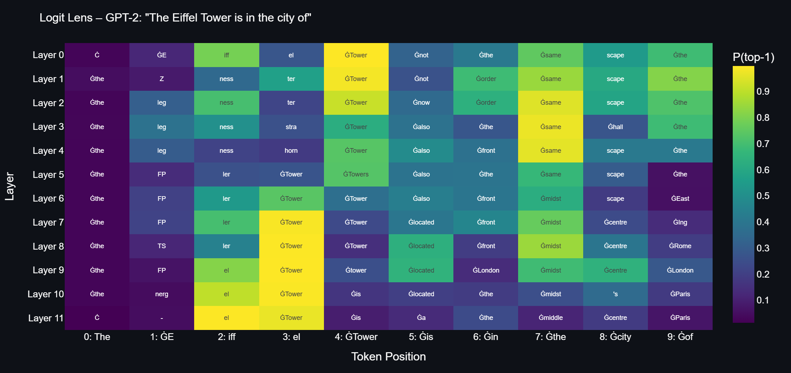
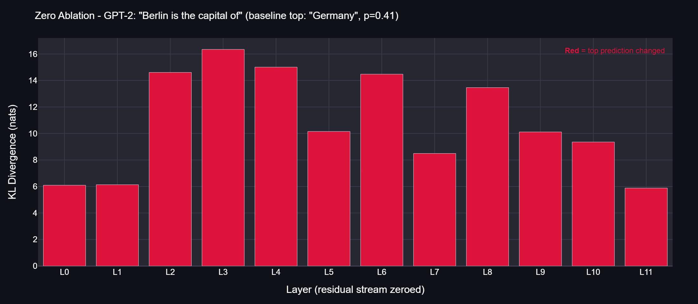
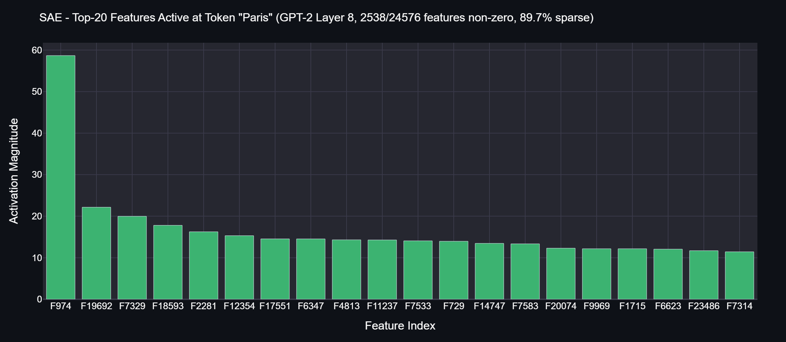

# TinyInterp

Local application for mechanistic interpretability of transformer models.



---

## What is this?

TinyInterp is a tool that runs on your machine and lets you look inside language models (GPT-2, Llama, Gemma, Phi, Mistral and others). You can:

- Load any model from HuggingFace (from 124M to 7B parameters)
- Run **Logit Lens** - see how the model builds its prediction layer by layer
- Run **Activation Patching** - causal tracing that shows which layers and positions are critical for prediction
- Train or load a **Sparse Autoencoder (SAE)** - find interpretable features in model activations
- Run **Ablations** - zero out or mean-ablate components and see what changes
- Generate **Scientific Reports** via local Ollama - AI analyzes your results like a skeptical scientist

Everything runs offline, no cloud, with automatic GPU detection.

---

## System Requirements

- **Python** 3.10 or newer
- **NVIDIA GPU** with CUDA (recommended) - RTX 3060 12GB or better
  - CPU mode works too, but slowly
- **RAM** 16 GB minimum, 32 GB recommended
- **Ollama** (optional, for report generation)
- **OS**: Windows 10/11, Linux, macOS

### Which models fit which GPU?

| Model | RTX 3060 (12GB) | RTX 3090/4090 (24GB) |
|-------|-----------------|----------------------|
| GPT-2 (124M) | OK | OK |
| GPT-2 Large (774M) | OK | OK |
| Llama 3.2 1B | OK | OK |
| Llama 3.2 3B | OK | OK |
| Phi-2 (2.7B) | OK | OK |
| Llama 7B (FP16) | Too large | OK |
| Llama 7B (4-bit) | OK (~5GB) | OK |
| Llama 13B (4-bit) | OK (~8GB) | OK |

---

## Installation

### 1. Clone the repository

```bash
git clone https://github.com/tomaszwi66/TinyInterp.git
cd TinyInterp
```

### 2. Create a virtual environment (recommended)

```bash
python -m venv venv

# Windows:
venv\Scripts\activate

# Linux/macOS:
source venv/bin/activate
```

### 3. Install PyTorch with CUDA support

If you have an NVIDIA GPU:

```bash
pip install torch torchvision --index-url https://download.pytorch.org/whl/cu124
```

CPU only:

```bash
pip install torch torchvision
```

### 4. Install dependencies

```bash
pip install -r requirements.txt
```

### 5. Run the app

```bash
streamlit run main.py
```

Opens in your browser at `http://localhost:8501`.

---

## Usage Guide

### Step 1: Load a model

1. Go to the **Model Loader** page (sidebar)
2. Pick a model from the list, e.g. `openai-community/gpt2` to start
3. Choose quantization:
   - **None** - full precision (more VRAM)
   - **8-bit** - half VRAM, minimal quality loss
   - **4-bit** - quarter VRAM, good quality (requires CUDA)
4. Click **Load Model**

### Step 2: Logit Lens

1. Go to **Basic Analysis**
2. Enter a prompt, e.g. "The Eiffel Tower is in the city of"
3. Click **Run Logit Lens**
4. The heatmap shows what the model "thinks" at each layer
5. Later layers should show "Paris" with increasing probability

### Step 3: Activation Patching

1. Go to **Activation Patching**
2. Enter clean prompt: "The Eiffel Tower is in the city of"
3. Enter corrupted prompt: "The Colosseum is in the city of"
4. Choose mode: **per_layer** (fast) or **per_position** (detailed but slower)
5. Click **Run Patching**
6. The heatmap shows which layers/positions are critical

### Step 4: SAE (Sparse Autoencoder)

**Loading a pre-trained SAE** (quick, for GPT-2):

1. Go to **SAE Training** - tab **Load Pre-trained SAE**
2. Select release `gpt2-small-res-jb` and a layer
3. Click **Load Pre-trained SAE**

**Training your own SAE** (takes minutes to hours):

1. Tab **Train New SAE**
2. Set parameters (defaults are reasonable)
3. Click **Start Training**

### Step 5: Feature Explorer

1. After loading an SAE, go to **Feature Explorer**
2. Enter text and click **Encode**
3. See which features activate and explore individual features

### Step 6: Ablations

1. Go to **Ablations**
2. Enter a factual prompt, e.g. "Berlin is the capital of"
3. Choose type: **zero** or **mean**
4. Choose component: layers / attention / mlp
5. Click **Run Ablation**

### Step 7: Reports (requires Ollama)

1. Install Ollama (see below)
2. Go to **Reports**
3. Select an Ollama model and an analysis to report on
4. Click **Generate Report**

---

## Ollama Setup

Ollama runs LLMs locally. TinyInterp uses it to generate scientific reports.

### 1. Install Ollama

Download from [ollama.com](https://ollama.com).

### 2. Pull a model

```bash
ollama pull llama3.2
```

### 3. Verify

```bash
ollama list
```

The models will appear in TinyInterp's **Reports** page automatically.

If you have a custom GGUF file:

```bash
echo 'FROM ./your-model.gguf' > Modelfile
ollama create my-model -f Modelfile
```

---

## Project Structure

```
TinyInterp/
├── main.py              # Streamlit entry point
├── config.py            # Constants, default models, Ollama prompt
├── requirements.txt     # Python dependencies
├── core/                # Computation logic
│   ├── loader.py        # Model loading (nnterp/nnsight)
│   ├── model_info.py    # Architecture info extraction
│   ├── logit_lens.py    # Logit lens analysis
│   ├── patching.py      # Activation patching
│   ├── sae.py           # SAE training and analysis
│   ├── ablation.py      # Ablation experiments
│   └── ollama_reporter.py # Report generation
├── pages/               # Streamlit pages
│   ├── 1_Model_Loader.py
│   ├── 2_Basic_Analysis.py
│   ├── 3_Activation_Patching.py
│   ├── 4_SAE_Training.py
│   ├── 5_Feature_Explorer.py
│   ├── 6_Ablations.py
│   └── 7_Reports.py
└── utils/               # Helpers
    ├── device.py        # GPU/CPU detection
    ├── background.py    # Background tasks
    ├── cache.py         # Disk cache
    └── export.py        # JSON/CSV/HTML export
```

---

## Troubleshooting

### "No CUDA GPU detected"
- Check: `python -c "import torch; print(torch.cuda.is_available())"`
- Reinstall: `pip install torch torchvision --index-url https://download.pytorch.org/whl/cu124`

### Out of memory
- Use 4-bit or 8-bit quantization
- Load a smaller model
- Close other GPU-using programs

### bitsandbytes on Windows
- Make sure you have version 0.44+: `pip install bitsandbytes>=0.44.0`

### Ollama not responding
- Check: `ollama list`
- Start server: `ollama serve`
- Default port: `http://localhost:11434`

### HuggingFace model requires login
- Accept the license on huggingface.co first
- Then: `huggingface-cli login`

---

## Technologies

- [nnsight](https://nnsight.net) + [nnterp](https://github.com/butanium/nnterp) - model hooks and interventions
- [SAELens](https://github.com/decoderesearch/SAELens) - sparse autoencoders
- [Streamlit](https://streamlit.io) - web interface
- [Plotly](https://plotly.com) - interactive visualizations
- [Ollama](https://ollama.com) - local LLMs for reports
- [PyTorch](https://pytorch.org) + [HuggingFace Transformers](https://huggingface.co/docs/transformers)

---

## Screenshots

These examples use prompts where the baseline prediction is clear and the visualization is not averaged across unrelated tokens.

| Logit Lens | Zero Ablation |
|---|---|
|  |  |

SAE feature ranking is shown for the selected token `Paris`, not a mean over every token in the prompt.



---

## License

MIT

Author: Tomasz Wietrzykowski
